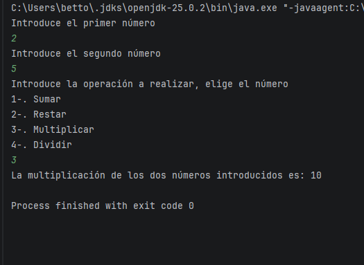
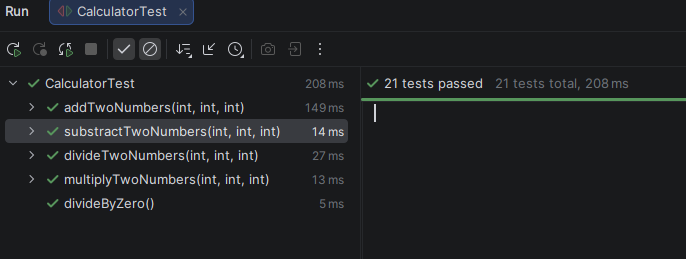

# Calculator Testing Java
## Description
It is an exercise that involves building a calculator using **TDD**, which means writing the tests first and then the code. This leads to better refactoring and results in better code.
I also use exception handling in case there is an error in the calculation, such as dividing a number by zero

## Features
- Applying TDD to make first tests and then the program.
- This exercise allows you to enter the two numbers using the keyboard and choose the operation you want.
- Methods of calculator: Add, Substract, Multiply and Divide.

## Structure
```
CalculatorJavaTesting
│
├── .idea
├── .mvn
│
├── src
│   ├── main
│   │   ├── java
│   │   │   └── org.example
│   │   │       └── calculator
│   │   │           ├── Calculator.java
│   │   │           └── Main.java
│   │   │
│   │   └── resources
│   │
│   └── test
│       └── java
│           └── CalculatorTest.java
│
├── target
├── .gitignore
└── pom.xml
```

## Run Excercise

- Clone this repository.
- Run Main Class in **Intellij** to run the programm
- Run CalculatorTest in the IDE to see all tests.


## Result in terminal


## Tests

